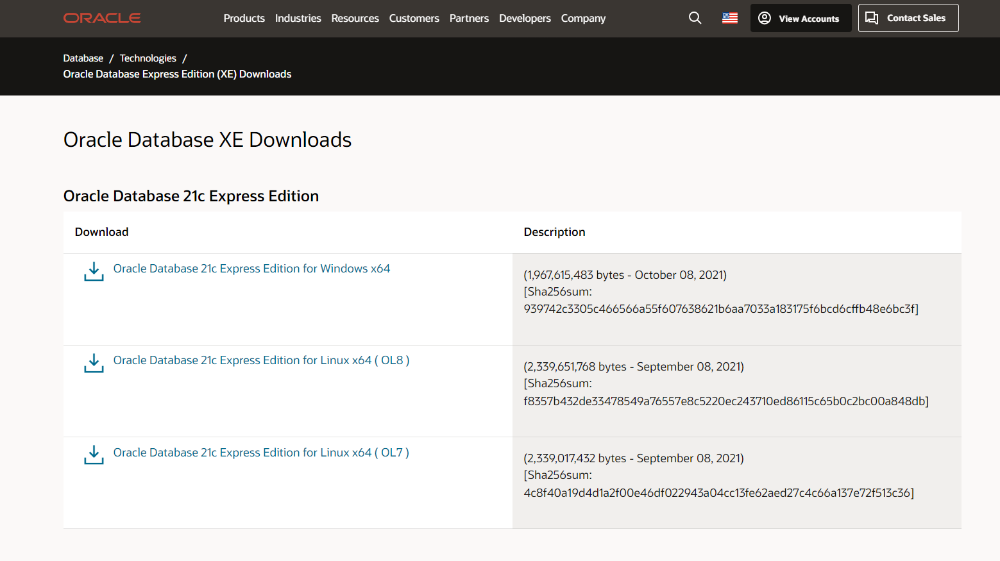
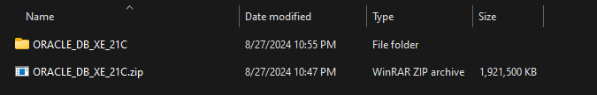
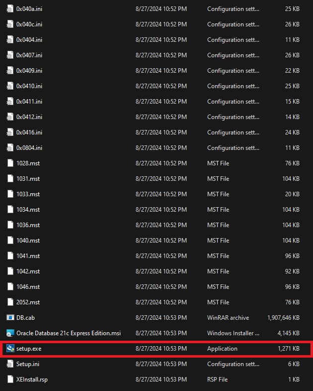
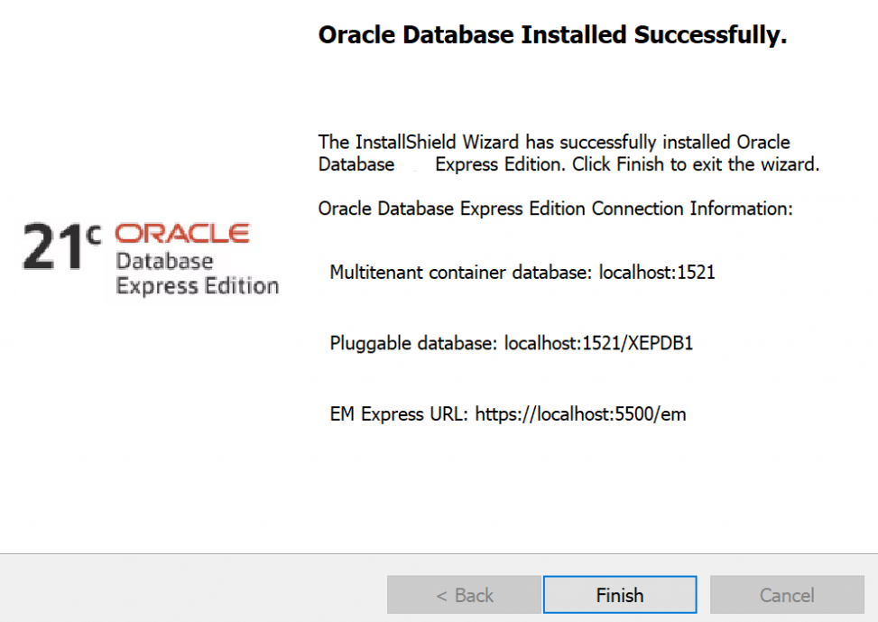
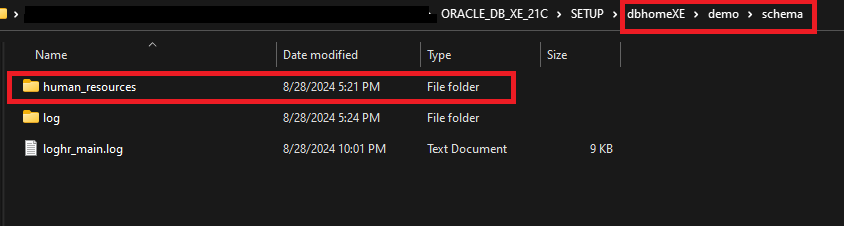
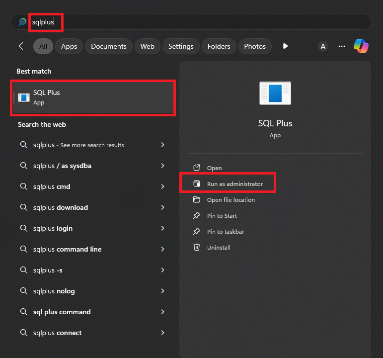
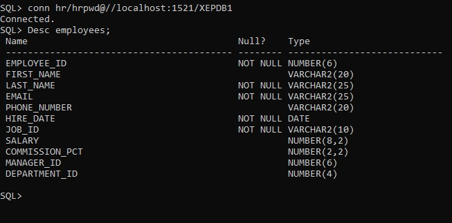

# Oracle XE 21c Database Setup Guide
### **By [MUHAMMAD ABDUL REHMAN KHAN](https://github.com/mabdulrehmankhan)**

---

Welcome to the **Oracle XE 21c Database Setup Guide**—your comprehensive resource for effortlessly downloading, installing, and configuring Oracle XE 21c along with the Sample HR Database. Follow these steps to ensure a smooth installation process.

---

## Steps to Download and Install Oracle XE 21c Database.
(**NOTE:** *Ensure you replace the path with the exact locations on your system.*)


### 1. Download Oracle XE 21c
1. Visit the [Oracle XE 21c download page](https://www.oracle.com/database/technologies/xe-downloads.html).

   

2. Choose the appropriate version for your operating system (Linux or Windows).
3. Download the installer package.
4. Unzip the downloaded file.

   

5. Locate and run `setup.exe`.

   

6. If an error occurs, locate the `ISSetupPrerequisites` folder.
7. Run the executable again. **Do not install on the C drive.**
8. Note down the password for the `sys` and `system` users.
9. Take a screenshot of the final screen showing the connection string information.

   


### 2. Configure Sample HR Database
1. Download `human_resources.zip` from the folder.
2. Unzip it and copy the `human_resources` folder to the `schema` folder in the Oracle installation folder (e.g., `ABDULREHMAN\ORACLE_DB_XE_21C\dbhomeXE\demo\schema`).
   **Note:** Replace the path with your exact and accurate path to the file.

   


3. Now, download `hr_main.sql` file from this repository.
4. Go to `schema` folder, delete the `hr_main.sql` from there, and paste the currently downloaded file there.
5. Now, Press the Windows button and search for `SQLPLUS`.
6. Run SQLPLUS as an administrator.

   

7. In the SQL prompt, type:
    ```sql
    connect sys as sysdba
    ```
8. Enter the password you set up during installation.
9. Provide the path to `hr_main.sql`:
    ```sql
    @D:\ABDULREHMAN\ORACLE_DB_XE_21C\dbhomeXE\demo\schema\human_resources\hr_main.sql
    ```
10. Press Enter.
11. Provide the following values:
    - **Parameter 1:** `hrpwd` (Password for HR)
    - **Parameter 2:** `users` (Default tablespace for HR)
    - **Parameter 3:** `temp` (Temporary tablespace for HR)
    - **Parameter 4:** `db` (Password for SYS)
    - **Parameter 5:** `$ORACLE_HOME/demo/schema/log` (Log path) _This location is default, Don't change this one_
    - **Parameter 6:** `localhost:1521/XEPDB1` (Connect string)

### 3. Check the Installation
1. Run the following command:
    ```sql
    conn hr/hrpwd@//localhost:1521/XEPDB1
    ```
2. Execute the following scripts one by one:  
   **Note:** Replace the path with your exact and accurate path to the file.
    ```sql
    @D:\ABDULREHMAN\ORACLE_DB_XE_21C\dbhomeXE\demo\schema\human_resources\hr_cre.sql
    @D:\ABDULREHMAN\ORACLE_DB_XE_21C\dbhomeXE\demo\schema\human_resources\hr_popul.sql
    @D:\ABDULREHMAN\ORACLE_DB_XE_21C\dbhomeXE\demo\schema\human_resources\hr_idx.sql
    @D:\ABDULREHMAN\ORACLE_DB_XE_21C\dbhomeXE\demo\schema\human_resources\hr_code.sql
    @D:\ABDULREHMAN\ORACLE_DB_XE_21C\dbhomeXE\demo\schema\human_resources\hr_comnt.sql
    @D:\ABDULREHMAN\ORACLE_DB_XE_21C\dbhomeXE\demo\schema\human_resources\hr_analz.sql
    ```
3. Run the following command:
    ```sql
    DESC employees;
    ```
4. If the query returns the schema of the `employees` table, the installation is successful.
5. The result should be like this:

   

### 4. Oracle SQL Developer (Skip this if you’re comfortable with SQL*Plus)
1. Visit the [SQL Developer Download page](https://www.oracle.com/database/sqldeveloper/technologies/download/).
2. Choose the appropriate version for your operating system (Linux or Windows).
3. Download the installer package.  
   **Note:** If you have Windows 64-bit, download "Windows 64-bit with JDK 11 included."
4. Unzip the downloaded file.
5. Run `sqldeveloper.exe`.
6. Open `sqldeveloper.exe`.
7. Click on the green color "+" icon on the top left corner.
8. Enter the following details:
    - **Name:** HR_SCHEMA
    - **Username:** `hr`
    - **Password:** `hrpwd`
    - **Hostname:** `localhost`
    - **Port:** `1521`
    - **Service name:** `xepdb1`
9. Click on "Test" to verify, then "Connect" to establish the connection.
10. Now, you have successfully installed and configured hr_schema via ORACLE SQL DEVELOPER.
